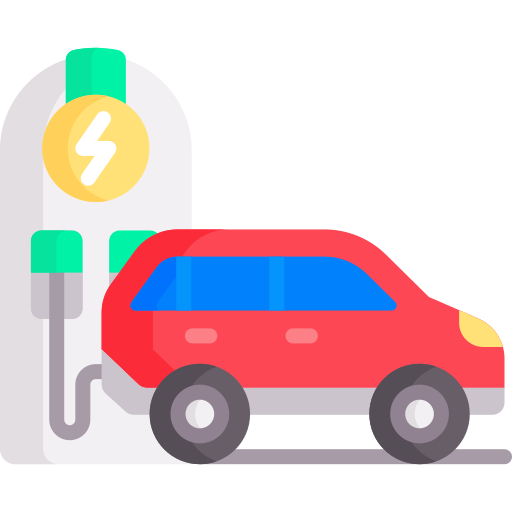

<h1 align="center">APMD-GS1</h1>

    

### Tópicos
:small_blue_diamond: [Global Solution](#global-solution-earth_americas)  
:small_blue_diamond: [Sobre](#sobre-book)  
:small_blue_diamond: [Recursos](#recursos-wrench)  
:small_blue_diamond: [Integrantes 3ECA](#integrantes-3eca-handshake)  

## GLOBAL SOLUTION :earth_americas:
Entregável da GS 1 FIAP de `Advanced Programming & Mobile Dev`, professor:

| [ João Carlos Lima](https://github.com/joaocarloslima) | 
| :---: 

:warning: Removemos as credenciais do banco de dados no arquivo `persistence.xml`

## Sobre :book:

    O projeto consiste em criar uma interface gráfica que gerencia os abastecimentos de carros elétricos nos postos, com um sistema de cadastro e consulta de dados em um banco de dados sobre os postos existentes no país, utilizando uma API do google maps mostrando a localização do ponto de recarga. 

    
    
    
    
    

## Recursos :wrench:
- [ ] Interface Gráfica
- [ ] Sistema de Cadastro
- [ ] Sistema de Consulta
- [ ] API Google Maps

## Integrantes 3ECA :handshake:
- Leonardo Cesar de Mendonça - 84689
- João Rafael Galhardo Rui - 82114
- Rafael Perez Masson - 84380
